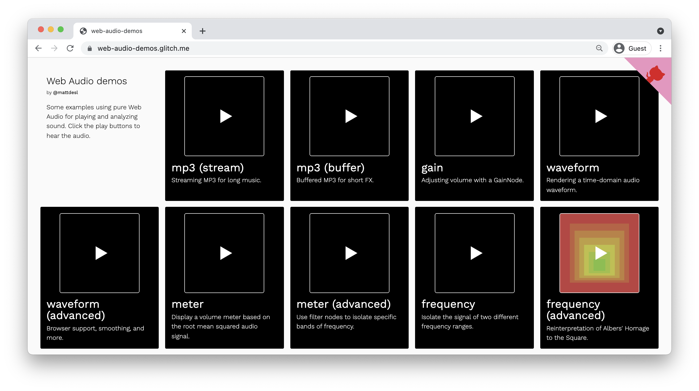

# Web Audio Synthesis & Visualization

This repository includes resources & course notes for those attending my _Web Audio Synthesis & Visualization_ workshop with Frontend Masters, demonstrating the raw Web Audio API, [p5.js](https://p5js.org) for rendering, and [Tone.js](https://tonejs.github.io) for synthesis.

<center><a href="https://web-audio-demos.glitch.me"></a></center>

# Contents

- ✨ [Course Demos](#course-demos)

- 🔧 [Tools](#tools)

- ✂️️ [Code Snippets](#code-snippets)

- 📖 [Setup](#setup)

- ✨ [Further Reading](#further-reading)

# Course Demos

- 📚 Collections

  - 🔈 **[web-audio-demos.glitch.me](https://web-audio-demos.glitch.me/)** — playback and visualization examples with pure WebAudio

  - 🔈 **[tone-demos.glitch.me](https://tone-demos.glitch.me)** — synthesis and other examples with Tone.js

  - 🎨 **[p5-demos.glitch.me](https://p5-demos.glitch.me)** — examples with p5.js

# Tools

Here is a list of tools and libraries that will be used during the workshop.

| Tool                                | Documentation                                                              | Version                                                               | Description                                                                        |
| ----------------------------------- | -------------------------------------------------------------------------- | --------------------------------------------------------------------- | ---------------------------------------------------------------------------------- |
| _A browser_                         |                                                                            |                                                                       | A modern browser, [Chrome](https://www.google.com/chrome/) is recommended          |
| [Glitch](https://glitch.com)        | [Help](https://glitch.com/help/)                                           |                                                                       | An online platform for editing & sharing JavaScript projects                       |
| _Web Audio API_                     | [API Docs](https://developer.mozilla.org/en-US/docs/Web/API/Web_Audio_API) |                                                                       | This API is built into modern browsers and allows us to work with audio and sound. |
| [Tone.js](https://tonejs.github.io) | [API Docs](https://tonejs.github.io/docs/)                                 | [13.8.25](https://unpkg.com/tone@13.8.25/build/Tone.js)               | A JavaScript audio library for playing synths and sounds                           |
| [p5.js](https://p5js.org)           | [API Docs](https://p5js.org/reference/)                                    | [0.9.0](https://cdnjs.cloudflare.com/ajax/libs/p5.js/0.9.0/p5.min.js) | A JavaScript graphics library for creative coding                                  |

# Just Starting Out

This workshop assumes you are comfortable with JavaScript and ES6 syntax, and instead focuses just on the audio side of things. If you're new to JavaScript, you might want to begin your journey below:

- [JavaScript For Cats](http://jsforcats.com/)

Also great is Daniel Shiffman's video series, which often uses p5.js:

- [Programming from A to Z](https://shiffman.net/a2z/)

A more comprehensive guide on the JavaScript language can be found here:

- [The Modern JavaScript Tutorial](https://javascript.info/)

And here's a useful cheat sheet to use as a reference:

- [Interactive JavaScript Cheat Sheet](https://htmlcheatsheet.com/js/)

# Code Snippets

I've also included a small "recipes" document that you can use as a reference if you are forgetting some of the patterns and recipes discussed during the workshop.

- [Code Snippets](./docs/snippets.md)

# Setup

If you want to run locally (without internet), clone this repo into a new folder, then use Node.js to cd into the folder and run the following to install dependencies:

```sh
npm install
```

Now, start the development server:

```sh
npm start
```

Edit files in `src/js` and see them reflected in the browser.

# Further Reading

More links to web audio, creative coding, and more:

- Resources & Tutorials

  - [awesome-web-audio](https://github.com/notthetup/awesome-webaudio) — A list that includes resources, books, and more on Web Audio

  - [The Coding Train](https://thecodingtrain.com) with Daniel Shiffman

  - [Creative Coding with Canvas & WebGL](https://frontendmasters.com/courses/canvas-webgl/) — My own course, if you want to continue exploring the world of creative coding and generative art

  - [awesome-audio-visualization](https://github.com/willianjusten/awesome-audio-visualization) — A large list of interesting Web Audio visualizers

  - [awesome-creative-coding](https://github.com/terkelg/awesome-creative-coding) — A large list of resources

- Math

  - [Sine / Cosine Reference](https://www.mathsisfun.com/algebra/trig-interactive-unit-circle.html)

  - [Sine and Cosine Calculator](https://www.desmos.com/calculator/hlqxvc6hho)

  - [math-as-code](https://github.com/Jam3/math-as-code) — A cheat sheet for mathematical notation in code form

- Learning Audio

  - [Learning Synths by Ableton](https://learningsynths.ableton.com/)

  - [Learning Music by Ableton](https://learningmusic.ableton.com/index.html)

  - [Music Theory](https://www.lightnote.co/)

- Fun Web Audio Sites

  - [generative.fm](https://play.generative.fm/browse)

  - [Patatap](https://patatap.com/)

  - [Blob Opera](https://artsandculture.google.com/experiment/blob-opera/AAHWrq360NcGbw?hl=en)

  - [Sounds of the Pub](https://soundsofthepub.com/)

  - [Pink Trombone](https://dood.al/pinktrombone/)

- Tools

  - [Spectrum Analyser](http://spectrum.surge.sh/) — see the frequency spectrum of an MP3 file

# License

MIT, see [LICENSE.md](./LICENSE.md) for details.
